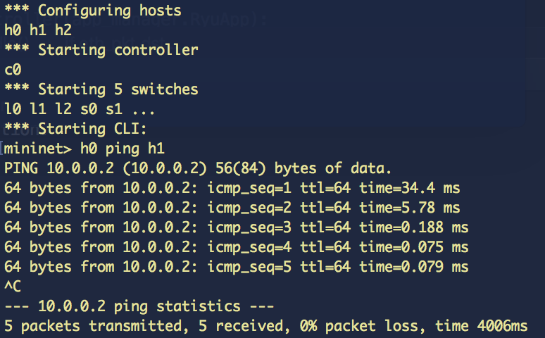

# Setup

```bash
ryu-manager switch.py
```

```bash
mn --custom mininetClosStartup.py --topo clos,3,2 --controller remote
```

# Output

## ryu-manager


## mininet



## Idee

Die Topologie welche im vorgegebenen mininetClosStartup aufgebaut wird, ist so dass jeder Leaf Switch auf den letzten Ports/Links mit Spine Switchs verbunden ist.
Dies wurde bei unserer Flowlogik so berücksichtig und vereinfachte diese. Der Ryu Controller schreibt sich auf dpset.EventDP Benachrichtigungen ein und führt eine Liste aller Spine und Leaf Switches. Das vorgegebene Startupskript funktionierte nicht zuverlässig ohne dpid parameter und wurde darum um diesen erweitert (es kam zu Duplikaten). Die Wahl der dpid ist aber nicht wichtig für die Logik und wird nicht verwendet, Sie muss nur eindeutig sein.
Jeder Spine und Leaf Switch führt eine eigene Forwarding Table mit MAC Addressen, auf den Leaf Switches jedoch nur auf den Host Ports und nicht auf den Spine Ports, auf den Spine Switches auf allen Ports.

Logik
- Wenn ein Leaf Switch ein Paket auf einem Host Port erhält, leitet er es auf den ersten Spine Switch Port weiter und erstellt eine Flow für den SrcPort des Paketes pro verbundenen Spine Port, dadurch sollte ein Loadbalancing entstehen, da alle dieselbe Prio haben.
- Wenn ein Leaf Switch ein Paket auf einem Spine Port erhält, sucht er in der Forwarding Table mit der DstMAC, sollte diese vorhanden sein, geht das Paket an den entsprechenden Port und ein Flow wird erstellt, ansonsten wird es an alle Host Ports weitergeleitet.
- Wenn ein Spine Switch ein Paket erhält und er einen Eintrag in der Forwarding Table hat leitet er es weiter und erstellt einen Flow, ansonsten gibt es einen Flood.

Die Logik ist Loopfrei, da aufgrund der dem Controller bekannten Topologie die Leaf Switches Pakete von Spine Switches nur an Host Ports weiterleiten und Pakete von Hosts nur an Spine Switches. Der Controller braucht keine statische Konfiguration und erkennt wenn im Mininet die Switches entfernt und hinzugefügt werden.
Das Loadbalancing konnten wir leider nicht testen, weil wir nicht wussten wie wir den Traffik analysieren konnten im mininet, wir sind davon ausgegangen, dass wenn es zwei Flows mit selber Prio gibt, dass dann das Loadbalancing vom Switch übernommen wird. Sollte dies nicht der Fall sein, wäre es aber keine grosse Anpassung im Controller um dies auf andere Weise zu lösen, da die Ports fürs Loadbalancing bekannt sind.